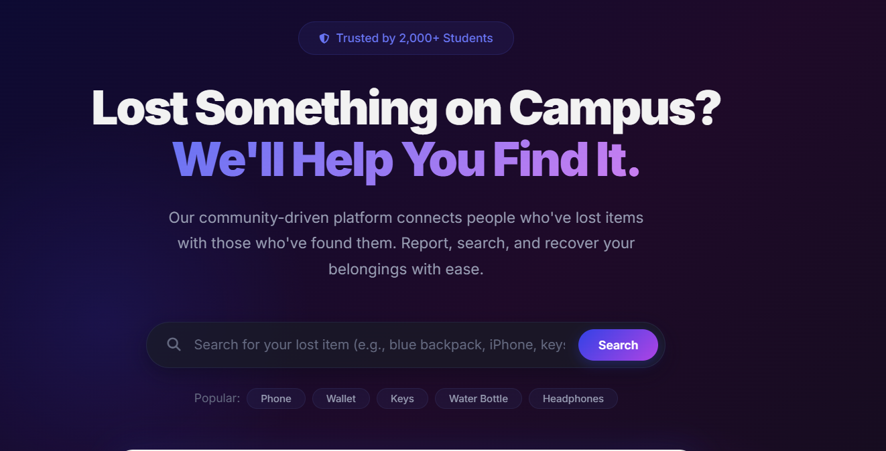
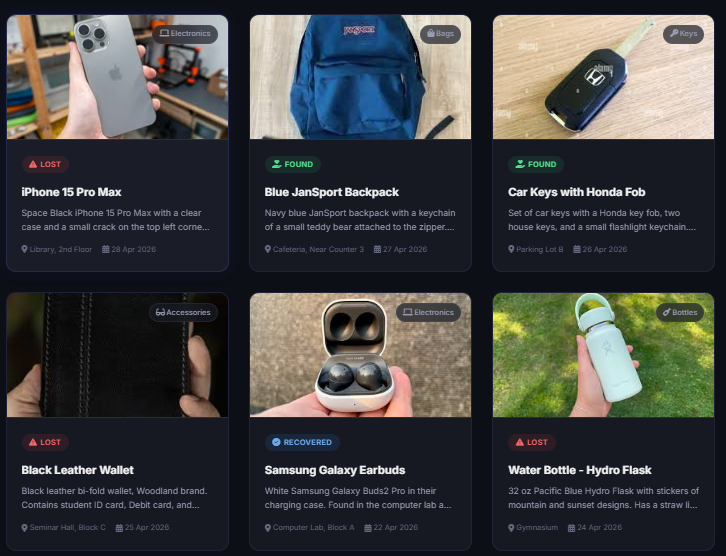
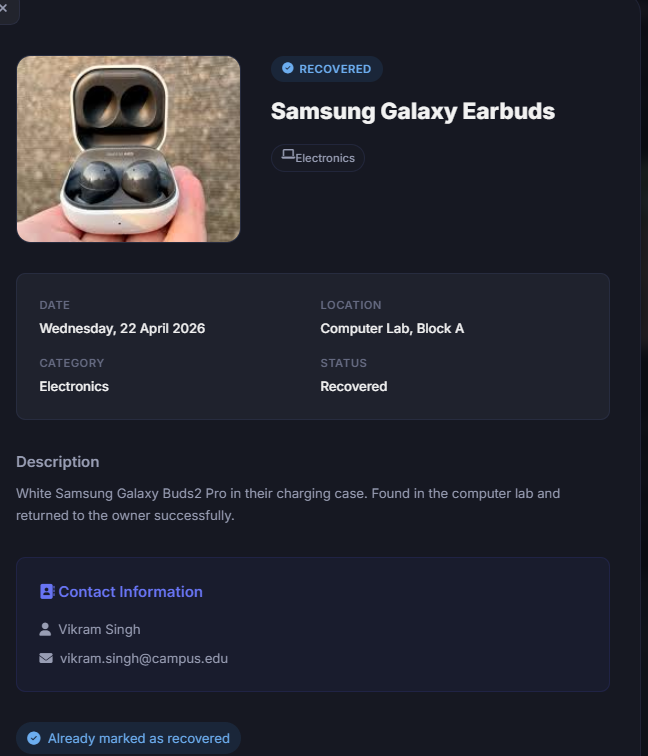
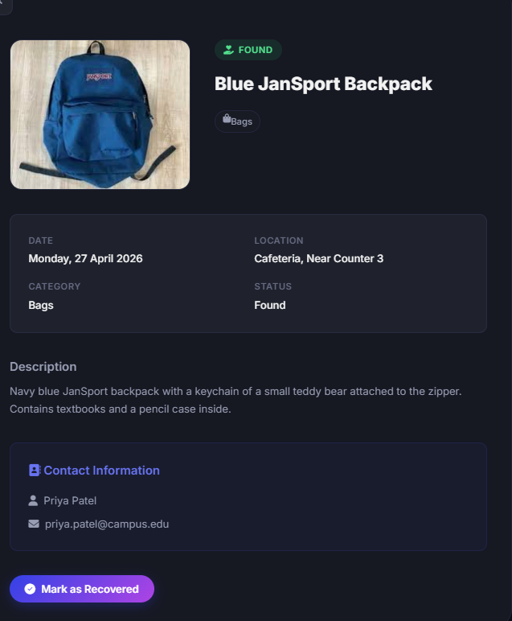
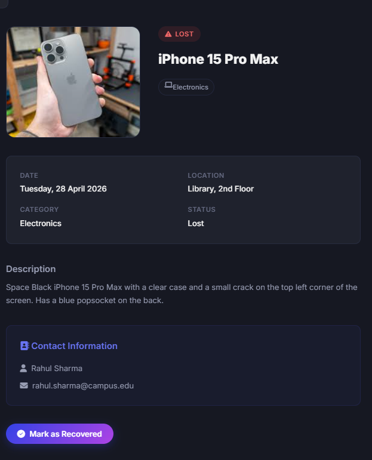

# CampusFind – Lost & Found Recovery System

CampusFind is a single-page **lost & found web application** designed for college campuses.  
Students can report lost or found items, browse existing reports, and mark items as recovered through a clean, modern UI. 

---

## ✨ Features

- **Report lost items** with title, category, date, location, description, and contact information.  
- **Report found items** so owners can quickly identify and claim their belongings.  
- **Browse all items** in a responsive card-based grid with images and status chips.  
- **Search & filter** by keyword, status (lost / found / recovered), category, and sort by date (newest / oldest).  
- **Item detail view** with full description, metadata, and contact information inside an accessible modal.
- **Mark as recovered** to indicate that an item has been returned to its owner.  
- **LocalStorage persistence** so reports remain even after page refresh.  
- **Animated statistics** showing total items reported, recovered items, active users (simulated), and recovery rate.  
- **Modern UI/UX** with gradients, glassmorphism, subtle animations, and responsive layout. 
- **Accessibility-conscious design** using ARIA roles, labelled modals, keyboard close behavior, and live region toasts. 

---

## 🖼️ Screenshots

All screenshots are stored in the `screenshots/` folder in this repository. Using a dedicated screenshots folder is a common GitHub pattern and keeps assets organized. 

### 1. Home page

Shows the hero section with search bar, stats, and call‑to‑action buttons.



### 2. Items list

Displays the filters bar and the responsive grid of lost and found item cards.



### 3. Marked item details (Recovered)

Item detail modal for an item that has been marked as **Recovered**.



### 4. Found item details

Item detail modal showing an item with **Found** status.



### 5. Lost item details

Item detail modal showing an item with **Lost** status.




---

## 🚀 Live Demo

Once you enable GitHub Pages for this repository, your live URL will look like this:

```md
🔗 **Live Demo (GitHub Pages):** https://aviralcodes29.github.io/campusfind-lost-and-found
```

Hosting a working demo makes the project look far more professional in your portfolio. 

---

## 🏗️ Tech Stack

- **Frontend:** HTML5, modern CSS3 (Flexbox, Grid, custom design system), vanilla JavaScript (no frameworks). 
- **State & storage:** Browser `localStorage` for persisting item reports.  
- **Icons & fonts:** Font Awesome 6, Google Fonts (Inter).  
- **Architecture:** Single Page Application (SPA-style) with modular JS pattern.

---

## 📁 Project Structure

```bash
campusfind-lost-and-found/
├─ index.html        # Main single-page UI and sections
├─ style.css         # Global styles, design tokens, layout & components
├─ script.js         # Application logic (SPA behavior)
├─ images/           # Logo and sample item images
└─ screenshots/      # Project UI screenshots used in README
```

Organizing screenshots in a separate folder and referencing them via relative paths in the README is a recommended practice. 

---

## ⚙️ Getting Started

These steps assume you have **Git** and a modern web browser installed.

### 1. Clone the repository

```bash
git clone https://github.com/Aviralcodes29/campusfind-lost-and-found.git
cd campusfind-lost-and-found
```

### 2. Open in your browser

You can open the project in two ways:

- **Option A – Directly from file system**  
  Simply double-click `index.html` or open it using:

  ```bash
  # macOS / Linux:
  open index.html

  # Windows:
  start index.html
  ```

- **Option B – Run a local dev server (recommended)**  
  Using VS Code Live Server, Python, or any static server for correct paths and caching.

  ```bash
  # Example using Python 3
  python -m http.server 8000

  # Then open:
  # http://localhost:8000
  ```

---

## 🔎 Usage

### Report a lost item

1. Click **“Report Lost”** in the navbar.  
2. Fill in the **item name**, **category**, **date**, **location**, **description**, and **contact** fields.  
3. Optionally upload an **image** of the item.  
4. Click **“Submit Lost Report”**.  
5. The item appears at the top of the list with status **Lost** and is saved in `localStorage`.

### Report a found item

1. Click **“Report Found”** in the navbar.  
2. Fill in similar details for the found item.  
3. Submit the form. The item appears with status **Found**.

### Search, filter, and sort items

- Use the **search bar** to filter items by name, description, location, or category.  
- Use **status filter**: All / Lost / Found / Recovered.  
- Use **category filter**: Electronics, Accessories, Documents, Clothing, Bags, Keys, Bottles, Other.  
- Use **sort**: Newest first or Oldest first.

### View item details and mark recovered

1. Click on any item card to open the **detail modal**.  
2. See full description, location, date, category, and **contact information**.  
3. If the item is not yet recovered, click **“Mark as Recovered”**.  
4. The item’s status changes to **Recovered**, the statistics update, and a success toast appears.

---

## 🧱 Code Architecture

CampusFind is implemented as a **modular vanilla JavaScript app** using an IIFE pattern (`CampusFindApp`) to keep the global scope clean. This follows patterns recommended for small, framework-free web apps.

### JavaScript (`script.js`)

- Encapsulated in:

  ```js
  const CampusFindApp = (() => {
    // state, DOM cache, functions

    return {
      init,
      filterItems,
      openModal,
      closeModal,
      openDetail,
      searchFromHero,
      quickSearch,
      submitReport,
      previewImage,
      markAsRecovered
    };
  })();

  document.addEventListener('DOMContentLoaded', CampusFindApp.init);
  ```

- **Core responsibilities:**
  - Seed **sample items** and hydrate from `localStorage`.  
  - Manage **state** (`items`, `nextId`) and `STORAGE_KEY`.  
  - Render cards in the **items grid** using `renderItems()`.  
  - Handle **filters** (search, category, status, sort) in `filterItems()`.  
  - Control **modals** (`openModal`, `closeModal`) with focus handling, ESC key, and overlay click close. 
  - Implement **hero search** and **quick search tags** (Phone, Wallet, Keys, etc.).  
  - Show **toast notifications** through an ARIA live region for accessibility.
  - Animate **stats counters** and **scroll-in elements**.

### HTML (`index.html`)

- Structured as a single page with sections:
  - `nav` – sticky navbar with logo, links, and primary actions.  
  - `#home` – hero section with search, popular tags, and illustration.  
  - `#stats` – animated stats cards.  
  - `#how-it-works` – 3-step explanation.  
  - `#items` – filters toolbar + items grid.  
  - Modals: **lost report**, **found report**, **item detail** (with ARIA attributes and proper labelling).  
  - `footer` – quick links and contact information.

### CSS (`style.css`)

- Built as a small **design system** with:
  - Color tokens (primary, accent, semantic: lost/found/recovered).  
  - Typography scale (`--font-size-*`).  
  - Spacing, radius, shadow, and gradient variables.  
- Uses **Flexbox and CSS Grid** for layout.  
- Includes **responsive breakpoints** at 1024px, 768px, and 480px.  
- Implements **glassmorphism**, **gradient cards**, and subtle **hover and scroll animations**.

---

## 🧪 Future Improvements

Some ideas for extending this project:

- Connect to a **real backend** (Node.js, Firebase, or Supabase) for multi-user data. 
- Implement **user accounts and authentication** so each user can manage their own reports. 
- Add **image compression** before upload for better performance.  
- Integrate **email or WhatsApp notifications** when a potential match is found.  
- Add **admin dashboard** for campus staff to verify and moderate reports.

---

## 🤝 Contributing

If someone wants to contribute:

1. **Fork** the repository.  
2. Create a new branch:

   ```bash
   git checkout -b feature/my-new-feature
   ```

3. Commit your changes:

   ```bash
   git commit -m "Add my new feature"
   ```

4. Push to your fork and open a **Pull Request**. 

---

## 🙌 Acknowledgements

- Inspired by campus **lost & found** systems and similar open-source projects.  
- UI patterns influenced by modern **single-page web apps** and accessibility guidelines. 

---

> Built by **Aviral Singh** ([Aviralcodes29](https://github.com/Aviralcodes29)) as  portfolio piece.
